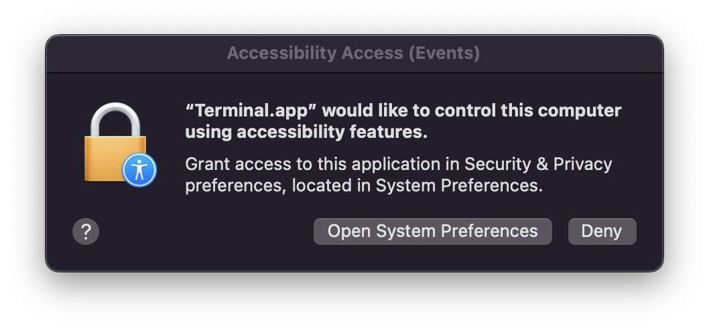
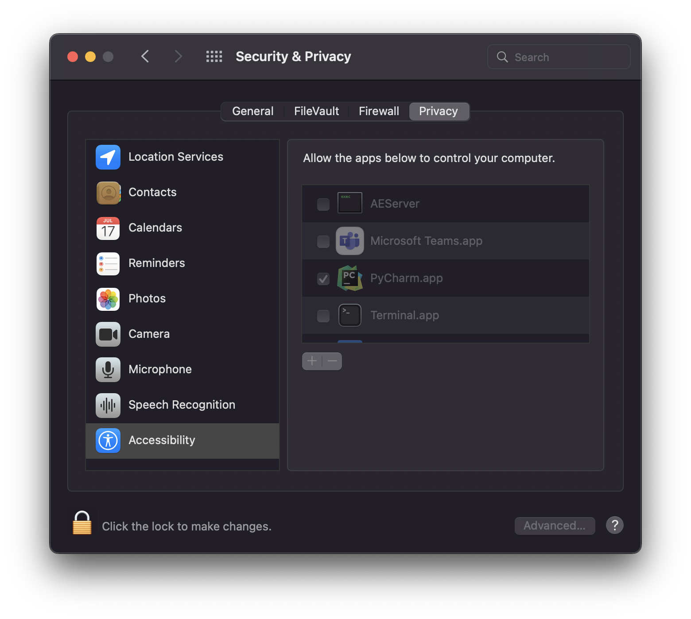
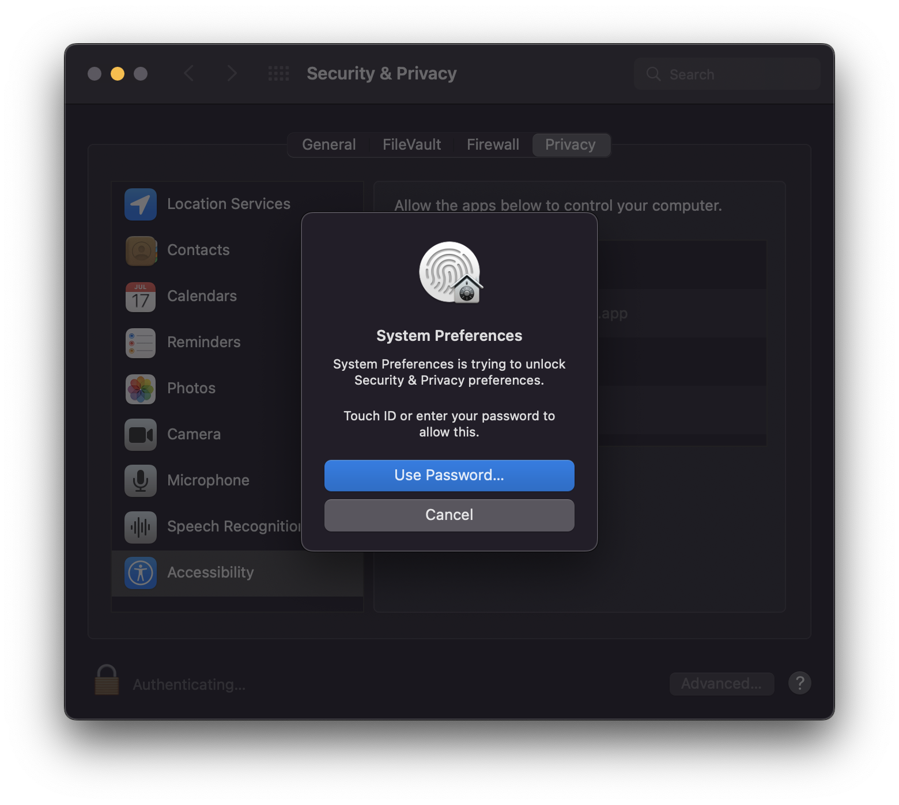
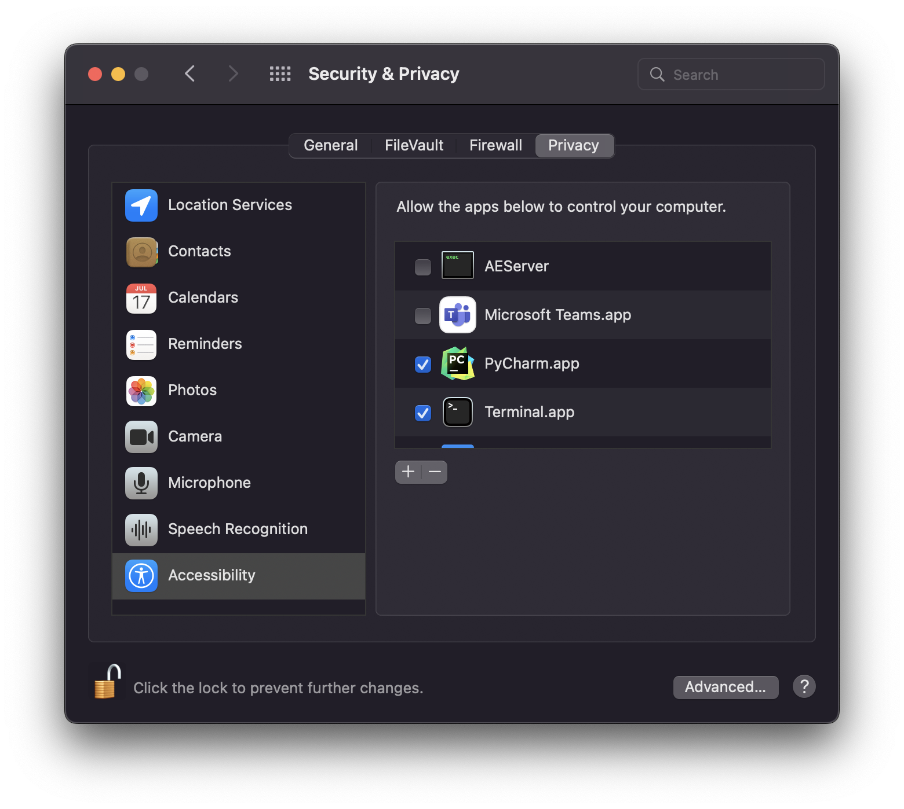

Automatically move the mouse...
====

## What is this?

This project is a very simple solution to the remote working problem of being monitored for screentime by your employer.

Every 5 seconds, your mouse is moved to a random location on your screen. This prevents your display from sleeping, as
the mouse has been moved.

Apparently, this works on Windows and Mac, although I use Mac, so cannot detail the Windows steps. Anyone fancy
contributing those?

## Why?

A friend of mine who's working in a different country complained that his employer was monitoring screentime, which
correlated to his paycheck. I'm in the UK, and this just sounds a bit wrong to me!

I put this little app together to allow him the time to make a couple of coffees throughout the day, although arguably
it could be used for a much longer break.

## Usage...

* Ensure Python 3.7 is installed, along with pip and clone (or download) this code.
* Using terminal, navigate to the directory containing this project.
* Install the requirements using `pip install -r requirements.txt` or `pip3.7 install -r requirements.txt`.
* Run the app using `python main.py` or `python3.7 main.py`.
* You might get a popup, asking you to give accessibility access to your terminal. You'll need to do that.
* If you have it running, and you need to close it, simply hold down the `ctrl` key and press `c`. ie, `ctrl+c`.

I've detailed the additional steps below that you'll need to use the first time you run this code...

#### One...

#### Two...

Click the little padlock down at the bottom left of the above image...

#### Three...

#### Four...

## Contributing

This project is open source, and you can contribute to it by making a pull request!
